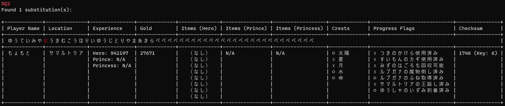

# Reじゅもん

ドラゴンクエストⅠ・Ⅱ　ふっかつのじゅもん　修正ツール

呪文生成ツールと違って、自動的に誤字を検出して修正するツールです。
紙に書いた呪文が誤っていた場合などに役立つように作りました。

※誤字は１文字まで検出する

## 使用方法

`rejumon [--name <name>] [--flags <flags>] [--keep-checksum] <input>`

* --name <name>: 名前を指定して固定します。
* --flags <flags>: フラグを指定して固定します。フラグの形式は5桁のバイナリ（例：10111）となります。各フラグの意味については、dq1.rs の PROGRESS_FLAG_TABLE か以下のスクリーンショットを参照してください。
* --keep-checksum: チェックサム（チェック値）を固定します。

呪文内に空白があってもOK

例:
```sh
rejumon --name もょもと ゆうていみやあうきむこうほりいゆうじとりやまあきらぺぺぺぺぺぺぺぺぺぺぺぺぺぺぺぺぺぺぺぺぺぺぺぺぺぺぺ
```

